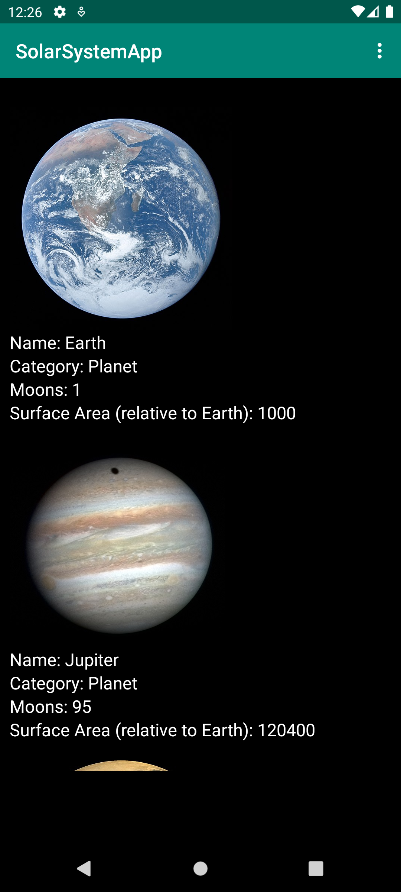
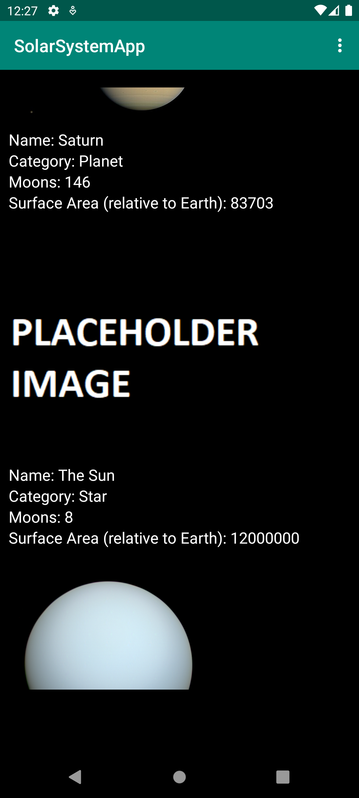
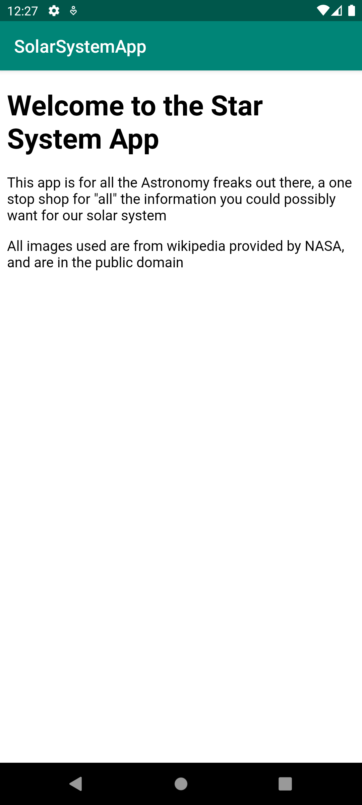

# Rapport - SolarSystemApp


## Jag har gjort det följande:

- Lagt till data i kursens webbtjänst.
- Hämtar datan genom JsonTask klassen och parsar den genom GSON.
- GSON lägger datan i en "Planet" klass med diverse attribut.
- Datan presenteras i applikationen genom en RecyclerView med hjälp av en RecyclerViewAdapter.
- Lagt till en "about" sida med hjälp av en till aktivitet tillsammans  med en intent.
- About sidan är en html fil som visas i aktiviteten med en webview.


```
function errorCallback(error) {
    switch(error.code) {
        case error.PERMISSION_DENIED:
            // Geolocation API stöds inte, gör något
            break;
        case error.POSITION_UNAVAILABLE:
            // Misslyckat positionsanrop, gör något
            break;
        case error.UNKNOWN_ERROR:
            // Okänt fel, gör något
            break;
    }
}
```



Bild av appen när man öppnar den


Bild av appen när en bild laddas


Bild av appens about sida